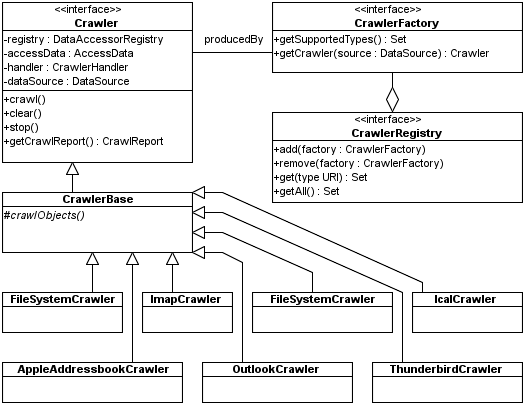
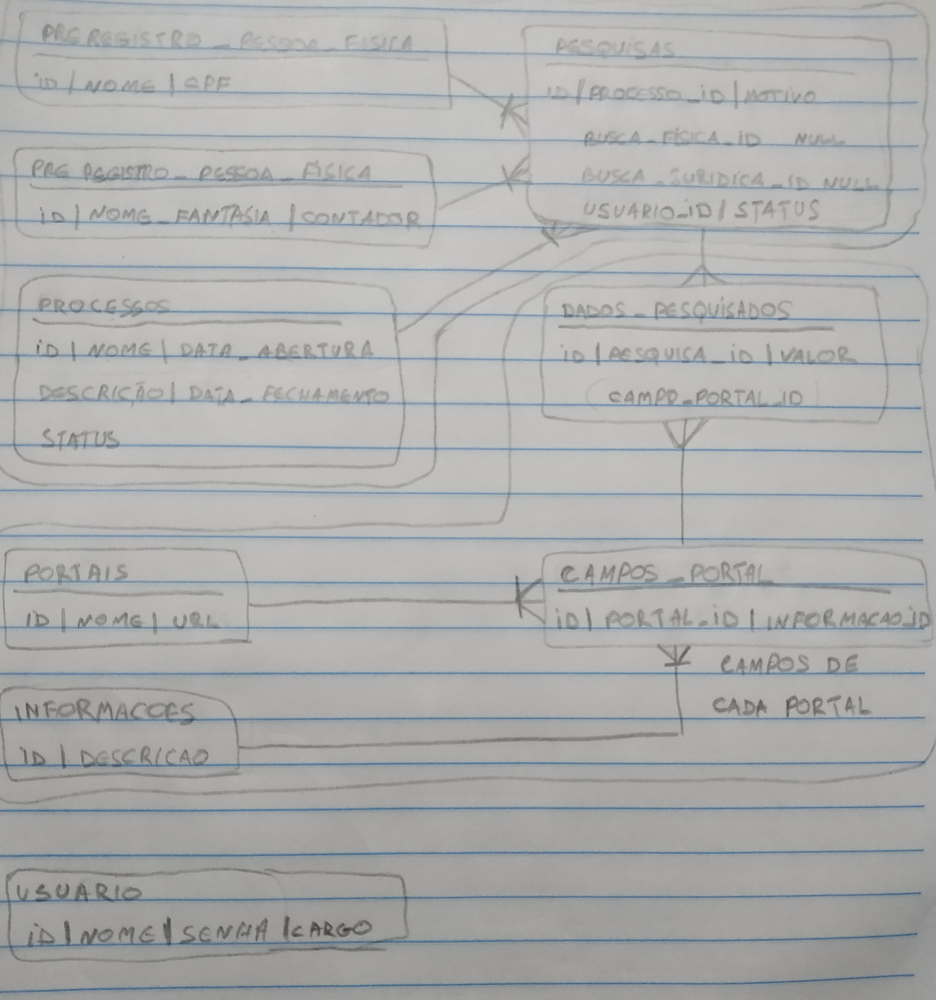

<p align="center">
  <a href="https://kraken-mpsp.herokuapp.com" rel="noopener" target="_blank">
    
  </a>
</p>

<h1 align="center">Kraken MPSP Server-Crawler</h1>

## 🎯 Visão Geral do Projeto

O Kraken MPSP é uma solução desenvolvida para o Ministério Público de São Paulo (MPSP) com o objetivo de centralizar e agilizar a consulta de informações sobre pessoas físicas e jurídicas investigadas. O sistema utiliza uma arquitetura de micro-serviços, composta por robôs de busca (crawlers) que coletam dados de diversas fontes públicas e uma API RESTful que disponibiliza esses dados de forma consolidada.

A solução visa reduzir o tempo gasto em investigações manuais, fornecendo uma plataforma única para acesso rápido e eficiente a informações cruciais para a resolução de processos judiciais.

Para uma documentação mais detalhada sobre a arquitetura, setup e como contribuir, veja nossa [Documentação Completa](DOCUMENTATION.md).

---

## 🏛️ Arquitetura da Solução

A aplicação é dividida em três projetos principais, cada um com uma responsabilidade clara:




1.  **[KrakenMPSPBusiness](./KrakenMPSPBusiness/README.md)**: Biblioteca de classes central que contém os modelos de negócio, interfaces e enumerações compartilhadas por toda a solução.
2.  **[KrakenMPSPConsole](./KrakenMPSPConsole/README.md)**: Aplicação de console responsável por orquestrar e executar os crawlers para a coleta de dados.
3.  **[KrakenMPSPServer](./KrakenMPSPServer/README.md)**: API RESTful em ASP.NET Core que expõe os dados coletados para consumo.

---

## 🚀 Começando

Siga as instruções abaixo para configurar e executar o ambiente de desenvolvimento local.

### Pré-requisitos

Certifique-se de que você tem os seguintes softwares instalados:

-   [.NET Core SDK 2.2](https://dotnet.microsoft.com/download/dotnet-core/2.2)
-   [.NET Framework 4.5](https://dotnet.microsoft.com/download/dotnet-framework/net45)
-   [MongoDB](https://www.mongodb.com/try/download/community)
-   [Firefox](https://www.mozilla.org/pt-BR/firefox/) (para a execução de crawlers baseados em Selenium)

### Instalação

1.  **Clone o repositório:**
    ```bash
    git clone https://github.com/JulioCesar82/kraken-mpsp-server-crawler.git
    cd kraken-mpsp-server-crawler
    ```

2.  **Restaure as dependências do .NET:**
    Navegue até a pasta de cada projeto (`KrakenMPSPBusiness`, `KrakenMPSPConsole`, `KrakenMPSPServer`) e execute o comando `dotnet restore`.

3.  **Configure o Banco de Dados:**
    -   Certifique-se de que sua instância do MongoDB está em execução.
    -   Atualize a string de conexão no arquivo `appsettings.json` dentro do projeto `KrakenMPSPServer` se necessário.

---

## 💻 Como Usar

### Executando os Crawlers

A aplicação de console é usada para iniciar a coleta de dados. Para mais detalhes, consulte o [README do KrakenMPSPConsole](./KrakenMPSPConsole/README.md).

```bash
# Navegue até a pasta do projeto de console
cd KrakenMPSPConsole/KrakenMPSPConsole

# Execute a aplicação (exemplo)
dotnet run -- --tipo=pf --documento=123.456.789-00
```

### Executando a API

A API serve os dados coletados. Para mais detalhes, consulte o [README do KrakenMPSPServer](./KrakenMPSPServer/README.md).

```bash
# Navegue até a pasta do projeto da API
cd KrakenMPSPServer/KrakenMPSPServer

# Inicie o servidor
dotnet run
```

Após iniciar, a documentação da API estará disponível em `http://localhost:5000/swagger`.

---

## Membros atuais da equipe do projeto

* [JulioCesar82](https://github.com/JulioCesar82) -
**Julio Ávila** <https://www.linkedin.com/in/juliocesar82>

## 🤝 Como Contribuir

Contribuições são bem-vindas! Se você deseja ajudar a melhorar este projeto, siga os passos abaixo:

1.  **Faça um Fork** do projeto.
2.  **Crie uma Branch** para sua feature (`git checkout -b feature/nova-feature`).
3.  **Faça o Commit** de suas mudanças (`git commit -m 'Adiciona nova feature'`).
4.  **Faça o Push** para a Branch (`git push origin feature/nova-feature`).
5.  **Abra um Pull Request**.

---
