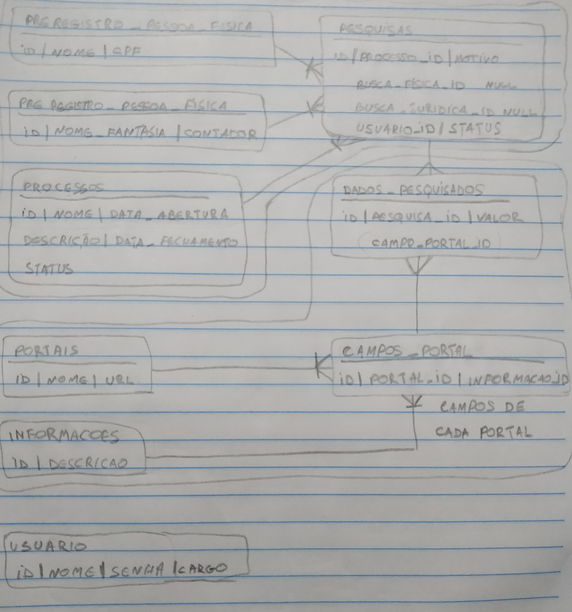

# kraken-mpsp-server-crawler
Projeto em desenvolvimento para o Ministerio Público de São Paulo - MPSP. Será um crawler em C# e React Native para agilizar os processos de busca de pessoas

#### Guias

http://ec2-18-231-116-58.sa-east-1.compute.amazonaws.com/login

#### Tips

 * [Guide Selenium](https://www.automatetheplanet.com/selenium-webdriver-csharp-cheat-sheet/)
 * [Tutorial Selenium](https://www.automatetheplanet.com/webdriver-dotnetcore2/)
 * [Using PhantomJS and GhostDriver with Selenium WebDriver in .Net](http://www.michael-whelan.net/using-phantomjs-with-webdriver/)
 * [How YOU can use an ORM in .NET Core and C# to type less SQL -starring Entity Framework](https://dev.to/dotnet/how-you-can-use-an-orm-in-net-core-and-c-to-type-less-sql-starring-entity-framework-49ka)
 * [An awesome guide on how to build RESTful APIs with ASP.NET Core](https://www.freecodecamp.org/news/an-awesome-guide-on-how-to-build-restful-apis-with-asp-net-core-87b818123e28/?gi=5827bfeb1996)
 * [ASP.NET Core + JWT + Refit: consumindo uma API protegida de forma descomplicada](https://medium.com/@renato.groffe/asp-net-core-jwt-refit-consumindo-uma-api-protegida-de-forma-descomplicada-9ef4ddfc78ac)
 * [Microservices Using ASP.NET Core](https://www.c-sharpcorner.com/article/microservice-using-asp-net-core/)
